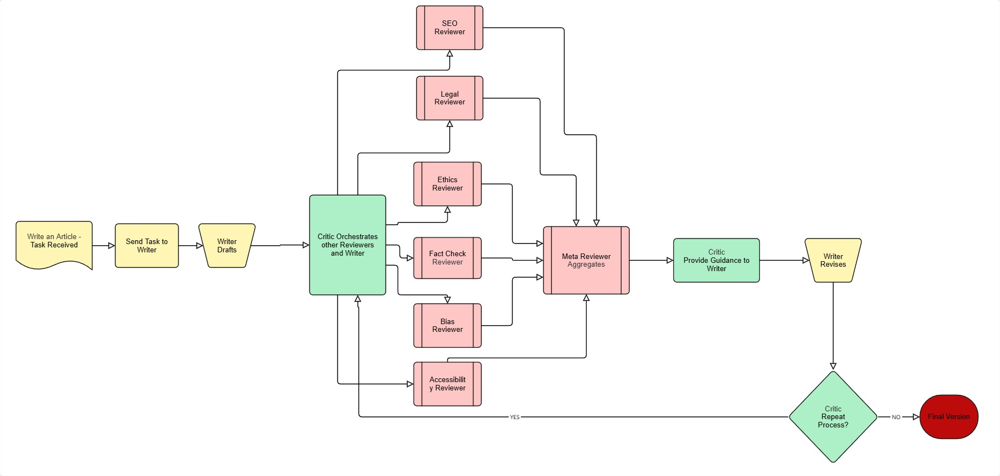

# Multi-Agent Blogpost Generator

An advanced AI-powered application that uses AutoGen (AG2) and Azure OpenAI to create high-quality blog posts through multi-agent collaboration. This Streamlit-based tool orchestrates multiple specialized AI agents to generate, review, and refine content with built-in SEO optimization, ethical considerations, and visual content generation.

📖 **Read the full article**: [Multi-Agent Blogpost Generator: AG2 + Azure OpenAI](https://medium.com/@tkadeethum/multi-agent-blogpost-generator-ag2-azure-openai-5ea8054eae3a) - A detailed walkthrough of the architecture and implementation.

## 🌟 Features

- **Multi-Agent Architecture**: Leverages 9+ specialized agents working collaboratively
- **Real-time Streaming**: Watch agents interact in real-time with per-message updates
- **Comprehensive Review System**: Automatic quality checks for SEO, legal, ethics, style, and content
- **Image Generation**: Integrated Azure OpenAI DALL-E support for blog illustrations
- **Publication Editor**: Built-in refinement tools for final polishing
- **Structured Feedback**: JSON-formatted reviewer feedback for actionable insights
- **Conversation Logging**: Full transparency with exportable conversation logs

## 🏗️ Architecture



### Core Agents

1. **Writer Agent**: Creates initial blog content based on user requirements
   - Uses GPT-5-2 model for creative content generation
   - Iteratively refines content based on reviewer feedback
   - Returns polished final draft without additional commentary

2. **Critic Agent**: Orchestrates the review process and synthesizes feedback
   - Uses O3 model for analysis and coordination
   - Manages nested chat conversations with all reviewers
   - Focuses on high-impact, actionable improvements
   - Triggers termination when content meets quality standards

### Specialized Reviewers

Each reviewer follows a structured JSON output format for consistent, parseable feedback:

- **SEOReviewer**: Optimizes content for search engines and web discoverability
  - Keyword density and placement
  - Meta descriptions and title optimization
  - Content structure for search visibility

- **LegalReviewer**: Ensures compliance, proper disclaimers, and copyright adherence
  - Trademark and copyright concerns
  - Required disclaimers and attributions
  - Regulatory compliance checks

- **EthicsReviewer**: Checks for bias, inclusivity, and ethical considerations
  - Inclusive language validation
  - Ethical implications of content
  - Cultural sensitivity review

- **FactChecker**: Verifies factual accuracy and identifies unsupported claims
  - Citation requirements
  - Statistical validation
  - Source credibility assessment

- **BiasReviewer**: Detects biased or exclusionary language
  - Neutral phrasing suggestions
  - Unconscious bias detection
  - Inclusive alternatives

- **AccessibilityReviewer**: Improves clarity and accessibility
  - Plain language recommendations
  - Alt-text opportunities
  - WCAG compliance suggestions

- **MetaReviewer**: Aggregates feedback from all reviewers
  - Synthesizes all reviewer input
  - Prioritizes critical improvements
  - Provides final recommendations

### Image Generation Agents

- **ImagePromptAgent**: Generates relevant image prompts for visual content
  - Creates 1-3 diverse, specific prompts
  - Considers accessibility and contrast
  - Avoids trademark/branding issues
  - Reflects article themes and metaphors

- **ImageCritic**: Refines and improves image generation prompts
  - Flags vagueness or bias in prompts
  - Ensures accessibility compliance
  - Suggests improvements for clarity
  - Validates brand/trademark safety

### Agent Collaboration Flow

```
User Input
    ↓
Critic Agent → Writer Agent
    ↓
Writer creates initial draft
    ↓
Critic triggers nested chats:
    ├── SEOReviewer
    ├── LegalReviewer
    ├── EthicsReviewer
    ├── FactChecker
    ├── BiasReviewer
    ├── AccessibilityReviewer
    └── MetaReviewer (aggregates all feedback)
    ↓
Feedback returned to Writer
    ↓
Writer refines content
    ↓
(Process repeats until termination)
    ↓
ImagePromptAgent (if enabled)
    ↓
ImageCritic(s) review prompts
    ↓
Final output
```

### Structured Review Format

All reviewers use a consistent JSON format:
```json
{
  "Reviewer": "ReviewerName",
  "Review": "- Point 1; - Point 2; - Point 3"
}
```

This ensures:
- Consistent parsing and display
- Actionable, concise feedback
- Easy aggregation of suggestions
- Machine-readable output for automation

## 📋 Prerequisites

- Python 3.8+
- Azure OpenAI API access with:
  - GPT-5-2 deployment (for content generation)
  - O3 deployment (for review and editing)
  - GPT-Image-1 deployment (for image generation)
- Required API credentials:
  - Azure endpoint URL
  - API key
  - API version (e.g., "2024-10-01-preview")

## 🚀 Installation

1. Clone the repository:
```bash
git clone <repository-url>
cd blog_post
```

2. Create a virtual environment:
```bash
python -m venv venv
source venv/bin/activate  # On Windows: venv\Scripts\activate
```

3. Install dependencies:
```bash
pip install -r requirements.txt
```

4. Set up environment variables:
```bash
# Create .env file
cp .env.example .env

# Edit .env with your Azure OpenAI credentials:
AZURE_OPENAI_ENDPOINT=https://your-resource.openai.azure.com/
AZURE_OPENAI_API_KEY=your-api-key
AZURE_OPENAI_API_VERSION=2024-10-01-preview

# Model deployments (as configured in your Azure resource)
AZURE_OPENAI_MODEL_WRITER=gpt-5-2
AZURE_OPENAI_MODEL_EDITOR=o3
AZURE_OPENAI_MODEL_CRITIC=o3
AZURE_OPENAI_MODEL_T2I=gpt-image-1
AZURE_OPENAI_MODEL_DEFAULT=gpt-5-2
```

## 🔧 Configuration System

### Overview

The application uses a sophisticated configuration system (`config.py`) that supports:
- Environment-based configuration
- Role-specific model assignments
- Automatic Azure OpenAI endpoint detection
- Flexible model deployment mapping

### Environment Variables

| Variable | Description | Required | Default |
|----------|-------------|----------|---------|
| `AZURE_OPENAI_API_KEY` | Your Azure OpenAI API key | Yes | - |
| `AZURE_OPENAI_API_VERSION` | API version (e.g., "2024-10-01-preview") | Yes | - |
| `AZURE_OPENAI_ENDPOINT` | Azure OpenAI resource endpoint | Yes | - |
| `AZURE_OPENAI_MODEL_DEFAULT` | Fallback model for all roles | No | gpt-4 |
| `AZURE_OPENAI_MODEL_WRITER` | Model for Writer agent | No | Falls back to DEFAULT |
| `AZURE_OPENAI_MODEL_EDITOR` | Model for Editor agent | No | Falls back to DEFAULT |
| `AZURE_OPENAI_MODEL_CRITIC` | Model for Critic and reviewers | No | Falls back to DEFAULT |
| `AZURE_OPENAI_MODEL_T2I` | Model for image generation | No | Falls back to DEFAULT |

**Note**: If any role-specific model is not defined, the system will use `AZURE_OPENAI_MODEL_DEFAULT`. If `AZURE_OPENAI_MODEL_DEFAULT` is also not defined, it defaults to `gpt-4`.

### Role-Based Model Mapping

The configuration system automatically assigns appropriate models to each agent based on their role:

```python
# Role to model mapping
{
    "writer": "gpt-5-2",      # Main content creation
    "critic": "o3",           # Review orchestration
    "editor": "o3",           # Final refinement
    "seo": "o3",             # SEO optimization
    "legal": "o3",           # Legal review
    "ethics": "o3",          # Ethics review
    "meta": "o3",            # Meta review
    "image": "o3",           # Image prompt generation
    "imagecritic": "o3"      # Image prompt refinement
}
```

### Model Descriptions

- **gpt-5-2**: Advanced language model optimized for creative content generation
- **o3**: High-performance model for analysis, review, and refinement tasks
- **gpt-image-1**: Specialized model for text-to-image generation

### Configuration Class Features

The `Config` class provides:
- Automatic environment variable loading
- Validation of required credentials
- Intelligent endpoint formatting
- Model deployment name management

### LLM Configuration Builder

The system includes helper functions for building agent configurations:
- `build_llm_config()`: Creates generic LLM configuration
- `build_role_llm_config()`: Creates role-specific configurations
- `build_image_request_url()`: Constructs Azure image API endpoints

## 💻 Usage

1. Start the application:
```bash
streamlit run app.py
```

2. Configure settings in the sidebar:
   - Azure credentials (if not using .env)
   - Timeout and seed values
   - Enable/disable specific reviewers
   - Choose streaming mode
   - Set image generation preferences

3. Enter your blog topic or use the default prompt

4. Click "Generate Blogpost" and watch the agents collaborate

5. Review the output:
   - Final blog post
   - Structured reviewer feedback
   - Generated images (if enabled)
   - Conversation logs

6. Use the Publication Editor to refine the content further

## ⚙️ Configuration Options

### Sidebar Settings

- **Azure Endpoint**: Your Azure OpenAI resource endpoint
- **API Key**: Authentication key (stored securely)
- **Timeout**: Maximum time for agent operations (default: 60s)
- **Seed**: For reproducible outputs (default: 42)
- **Reviewer Max Turns**: Iterations for reviewer feedback (1-10)
- **Main Chat Max Turns**: Total conversation rounds (1-20)
- **Streaming Mode**: 
  - Off: Wait for complete generation
  - Per-Message: Real-time message updates

### Image Generation

- **Auto-generate**: Automatically create blog illustration
- **Image Size**: 1024x1024, 1024x1536, 1536x1024, or auto
- **Manual Generation**: Generate images from custom prompts

## 📁 Project Structure

```
blog_post/
├── app.py              # Main Streamlit application
├── agents.py           # Agent definitions and initialization
├── config.py           # Configuration and LLM setup
├── utils.py            # Utility functions and models
├── requirements.txt    # Python dependencies
├── .env.example        # Environment variables template
└── README.md          # This file
```

### Key Files Description

- **config.py**: Central configuration management
  - Environment variable loading
  - Azure OpenAI setup
  - Role-based model mapping
  - LLM configuration builders
  
- **agents.py**: Agent initialization and orchestration
  - Creates all specialized agents with role-specific prompts
  - Configures nested chat patterns for reviewer coordination
  - Implements reflection-based message passing
  - Manages structured output requirements
  - Handles dynamic agent enabling/disabling
  - Sets up image generation workflow

- **app.py**: Main Streamlit application
  - **User Interface Components:**
    - Sidebar configuration panel with Azure credentials
    - Dynamic reviewer enable/disable toggles
    - Adjustable parameters (timeout, seed, max turns)
    - Streaming mode selection for real-time updates
  - **Core Features:**
    - Multi-agent orchestration with AutoGen/AG2
    - Real-time message streaming during generation
    - Session state persistence across reruns
    - Conversation log capture and export
  - **Image Generation:**
    - Integrated Azure DALL-E support
    - Auto-generation from blog title
    - Manual prompt-based generation
    - Multi-image batch processing from AI-derived prompts
    - Curl command examples for API usage
  - **Post-Processing Tools:**
    - Structured reviewer feedback parsing and display
    - Publication editor with style guidelines
    - Revision history tracking
    - Debug mode for troubleshooting JSON parsing
  - **Publishing Checklist:**
    - Built-in best practices reminders
    - SEO optimization guidelines
    - Accessibility compliance checks
    - Legal and ethical considerations

- **utils.py**: Utility functions
  - Review model validation
  - JSON parsing helpers
  - Text processing functions
  - Default reviewer definitions

### Application Workflow

1. **Configuration Phase**
   - User configures Azure OpenAI credentials
   - Selects active reviewers and parameters
   - Chooses streaming preferences

2. **Generation Phase**
   - Multi-agent collaboration begins
   - Writer creates initial draft
   - Reviewers provide structured feedback
   - Iterative refinement occurs

3. **Post-Processing Phase**
   - Final blog post display
   - Structured feedback visualization
   - Image generation (auto or manual)
   - Publication editor for final polish

4. **Export Phase**
   - Download generated images
   - Export conversation logs
   - Copy refined content

### UI Features Detail

#### Streaming Modes
- **Off**: Traditional execution, waits for complete generation
- **Per-Message**: Real-time message updates as agents communicate

#### Image Generation Options
- **Auto-generate**: Creates hero image based on blog title
- **Size Options**: 1024x1024, 1024x1536, 1536x1024, auto
- **Batch Processing**: Generate multiple images from AI-derived prompts
- **Inline Generation**: Manual prompt-based image creation

#### Publication Editor
- **Style Guidelines**: Customizable writing rules
- **Auto-Refine**: AI-powered content polishing
- **Version Control**: Track all edits and revisions
- **Revert Options**: Return to original content

#### Debug Features
- **Reviewer Debug Mode**: Shows raw JSON responses and parsing errors
- **Conversation Logs**: Full agent interaction history
- **Error Handling**: Detailed error messages for troubleshooting

## 🔧 Troubleshooting

### Common Issues

1. **Image generation fails with 400 error**
   - Ensure you're using supported image sizes
   - Check API version compatibility
   - Verify image model deployment name

2. **Reviewer feedback not parsing**
   - Enable "Show Reviewer Debug" to see raw output
   - Check JSON formatting in reviewer responses
   - Increase reviewer max turns for better results

3. **Timeout errors**
   - Increase timeout value in sidebar
   - Reduce max turns for faster generation
   - Check Azure OpenAI service status

4. **Missing dependencies**
   ```bash
   pip install --upgrade -r requirements.txt
   ```

5. **Streaming mode issues**
   - Try switching between "Off" and "Per-Message"
   - Check for threading conflicts
   - Ensure stable network connection

6. **Session state persistence**
   - Refresh page if state seems corrupted
   - Check browser console for errors
   - Clear cache if necessary

## 🛡️ Security Considerations

- API keys are masked in the UI
- Use environment variables for production
- Never commit `.env` files to version control
- Regularly rotate API keys

## 📄 License

This project is licensed under the MIT License - see the LICENSE file for details.

## 🤝 Contributing

Contributions are welcome! Please feel free to submit a Pull Request.

## 📞 Support

For issues and questions:
- Check the troubleshooting section
- Review conversation logs for agent errors
- Enable debug mode for detailed feedback
- Submit issues on GitHub

## 📚 Resources

- **Medium Article**: [Multi-Agent Blogpost Generator: AG2 + Azure OpenAI](https://medium.com/@tkadeethum/multi-agent-blogpost-generator-ag2-azure-openai-5ea8054eae3a) - Comprehensive guide explaining the architecture, implementation details, and real-world applications
- **AG2 (AutoGen) Documentation**: [AG2 GitHub Repository](https://github.com/ag2ai/ag2)
- **Azure OpenAI Service**: [Azure OpenAI Documentation](https://learn.microsoft.com/en-us/azure/ai-services/openai/)

## 🚀 Future Enhancements

- Additional agent specializations (Technical, Marketing, etc.)
- Multi-language support
- Export to various formats (WordPress, Medium, etc.)
- Integration with content management systems
- Advanced analytics and performance metrics
